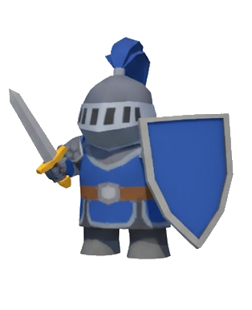

# GameJam_Cailly_Ombeline_squelettes

## Description
You are a knight that fight death creatures (skeletons and ghosts). You have to protect your house and you can build different buildings that give you bonus like XP.

##Comment lancer 
## Visuals

Depending on what you are making, it can be a good idea to include screenshots or even a video (you'll frequently see GIFs rather than actual videos). Tools like ttygif can help, but check out Asciinema for a more sophisticated method.

## Installation
Within a particular ecosystem, there may be a common way of installing things, such as using Yarn, NuGet, or Homebrew. However, consider the possibility that whoever is reading your README is a novice and would like more guidance. Listing specific steps helps remove ambiguity and gets people to using your project as quickly as possible. If it only runs in a specific context like a particular programming language version or operating system or has dependencies that have to be installed manually, also add a Requirements subsection.

## Roadmap
I would like to add the possibility to fix the buildings when they are destroyed.
It would be interesting to have differents levels.
Of course, add others monsters and buildings.

## Credits
This small game was developed with Unity for a lab exam in my Bachelor's Degree in Computer Science.
I had to create a game inspired by a fake game add demo. I choose King shot.
The project was assigned as part of the MAIN501 module, coordinated by Dr. Jessica Jonquet, with lab sessions led by Mr. Hua Wong.
